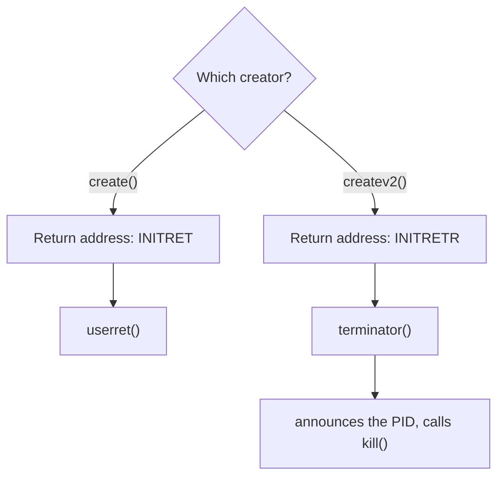
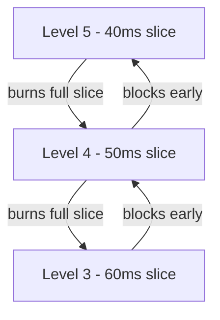
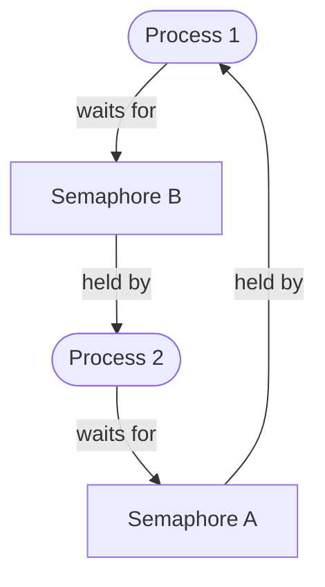
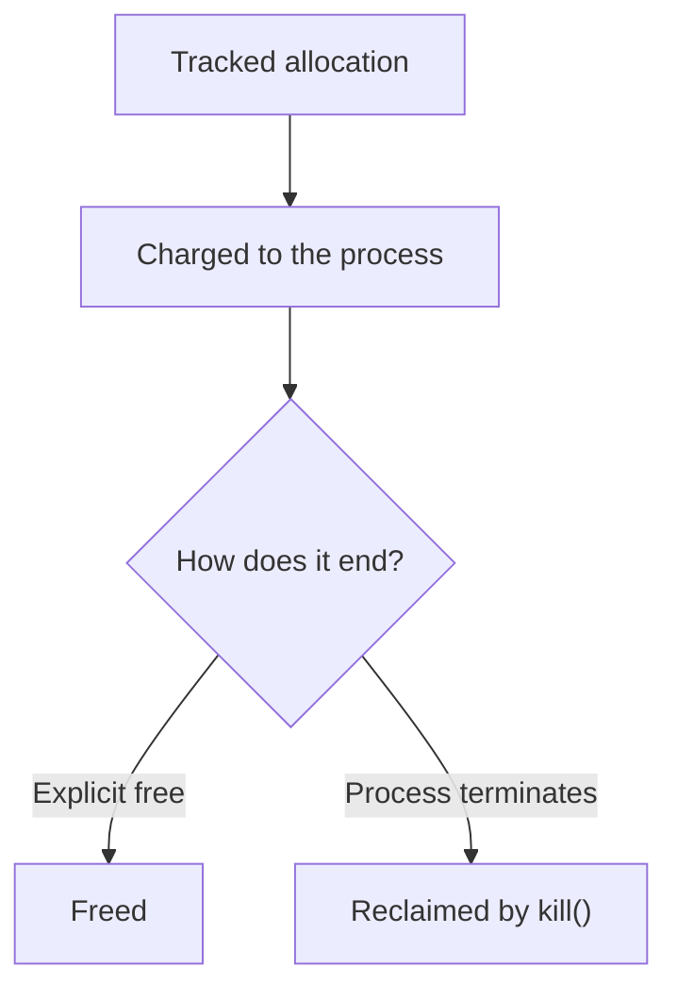
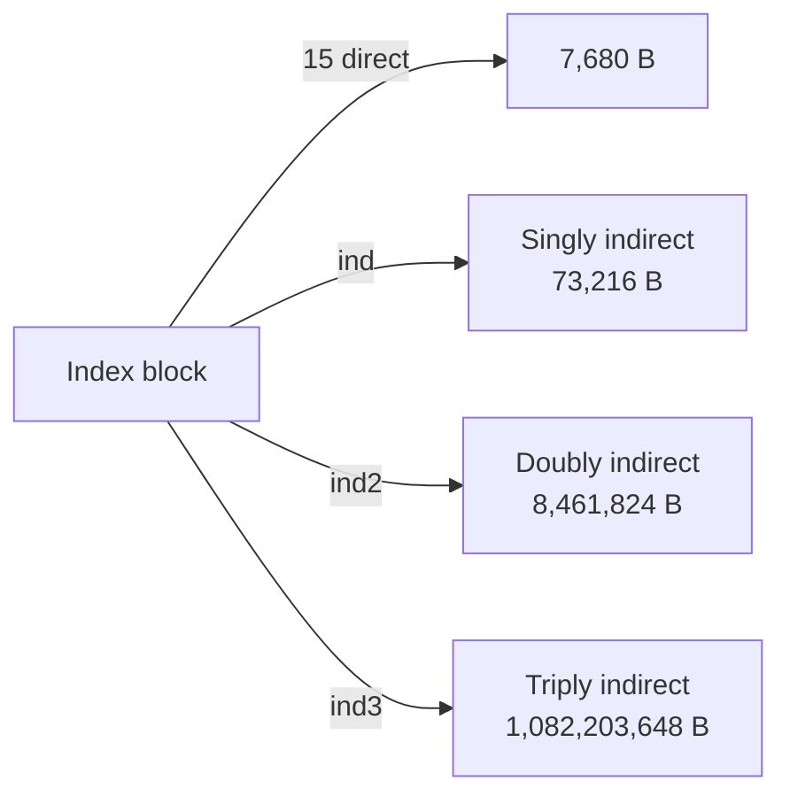

# XINU on Intel Galileo

I took a teaching kernel, added six subsystems to it, merged them into one
tree, and booted the result on an Intel Galileo board over a serial console.
This repository is what I learned doing it: five design notes, the diagrams,
and the recording of the boot.

**Live site:** _set once deployed_

---

## 01 · Process management

A second process-creation path that changes where a process lands when its
top-level function returns. Stock XINU seeds every new stack with the same
return address; `createv2()` seeds a different one, so a process that returns
normally announces itself and cleans up instead of falling into the default
exit path.

[Full note](content/writeups/01-process-management.md)

---

## 02 · Scheduling

Priority follows behaviour. Burn a whole time slice and you are demoted to a
lower priority with a longer slice; block before your slice runs out and you
are promoted. Nine levels, each with its own quantum.

The interesting part is that this is exploitable, and I wrote the exploit.
`sneaky()` busy-waits until its slice is nearly gone, then sleeps for one
millisecond, so the scheduler keeps reading it as interactive. It finished
with 5,350 ms of CPU at the top priority, against 372 ms and 374 ms for the
honest CPU-bound processes the scheduler had demoted to the bottom.

[Full note](content/writeups/02-scheduling.md)

---

## 03 · Deadlock detection

Semaphore ownership and waiting are kept as a resource-allocation graph in
static memory. Every 500 ms the clock interrupt handler walks it looking for a
cycle, which is what a deadlock is: a closed loop of processes each holding
what the next one wants.

[Full note](content/writeups/03-synchronization.md)

---

## 04 · Garbage collection

Every allocation is charged to the process that made it. When a process dies,
the kernel walks whatever it never freed and returns it to the heap, so a
process leaking memory costs you until it exits rather than until you reboot.

[Full note](content/writeups/04-garbage-collection.md)

---

## 05 · Filesystem

The starter driver resolved the first 7,680 bytes of a file and panicked on
anything past that. I replaced the panic with the classic Unix scheme:
pointers to pointers, three levels deep, so a 512-byte index block addresses
just over a gigabyte.

[Full note](content/writeups/05-filesystem.md)

---

## The boot

`data/transcript.txt` is the serial output captured the first time the merged
kernel ran on real hardware. It boots, reports 233,393,696 bytes of free
memory, runs every subsystem above in one demo, and exits cleanly. The site
types it out at the pace the board produced it.

## Credit where it is due

XINU is a teaching kernel written by Douglas Comer at Purdue University. The
network stack, shell, device drivers, memory allocator and boot path are his,
and so is the filesystem scaffold the indirect-block work plugs into. None of
that source is in this repository. Everything described above is what I added
on top of it, and each design note opens by naming exactly which files are
mine.
