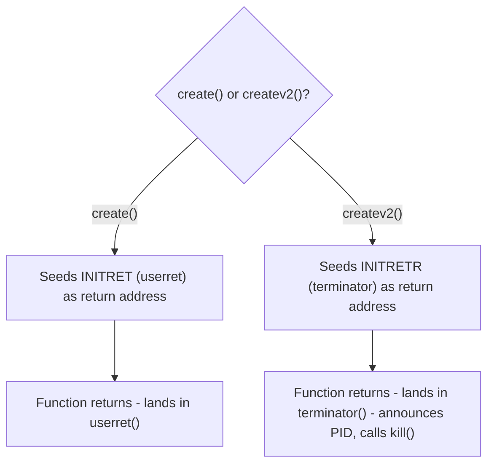

# Process Management

Source: `system/sayhello.c`, `system/outputch.c`, `system/createv1.c`,
`system/createv2.c`, `system/terminator.c`, `system/getparentstate.c`,
`include/process.h`, `include/prototypes.h`.

## The problem

XINU's stock `create()` builds a suspended process: it validates the
requested stack size and priority, allocates a stack, fabricates an initial
stack frame that makes the process's first context switch look like it is
resuming from an ordinary function call, and returns a PID. This body of
work modifies that pipeline in two independent directions without touching
`create()` itself: adding policy rules around process creation
(`createv1`), and changing where a process's control flow lands when its
top-level function returns normally (`createv2`). A third, unrelated piece
adds a query syscall for inspecting another process's parentage.

## Design

Rather than editing the shared `create()`, each variant is a full copy of
it with a small, targeted delta: `createv1.c` is 139 lines with roughly 10
original lines; `createv2.c` is 128 lines with roughly 2. The rest,
including the entire x86 stack-frame construction and the `newpid()`
free-slot scanner, is unmodified stock code carried along because XINU has
no mechanism for a create-with-hooks. That duplication is worth naming
plainly: the claim here is "modified process creation with new policy
rules," not "wrote a process creator."

## Key data structure

The mechanism both variants depend on is XINU's fabricated stack frame: a
new process never actually calls its entry function. `create()` pushes
values onto the new stack so that when the scheduler's `ctxsw()` "returns"
into this process for the first time, the CPU lands on the entry function
as if it had just been called, and if that function later executes an
ordinary `return`, control lands on whatever address was pushed as the
return address, normally `userret()` (`INITRET`).

## Mechanism

**`createv1()`** (`system/createv1.c:29-38, 50-54`) adds three rules on top
of that stock path: an oversized stack request is clamped to the null
process's stack size; a negative priority is rejected outright; and a
priority argument of exactly `1` is reinterpreted as "one above my own
priority" rather than a literal priority. All three are ordinary
argument-validation branches ahead of the existing `newpid()`/`getstk()`
calls. Nothing about the stack-frame construction changes.

**`createv2()`** (`system/createv2.c:75`) changes one line: it pushes
`INITRETR` (`terminator`) instead of `INITRET` (`userret`) as the fabricated
return address. This is a small edit with a real idea behind it: control
flow after a process's normal return is entirely a property of what address
was written into its own stack frame at creation time, so redirecting it is
a one-word change. `terminator()` (`system/terminator.c`) then announces
the exiting PID and calls `kill()` on itself.

The two paths diverge only in that one seeded address:

**`getparentstate()`** (`system/getparentstate.c`) is the one fully
original file in this group: given a PID, it validates the PID range,
confirms the slot is not `PR_FREE`, reads `prparent`, validates that PID in
turn, and returns the parent's `prstate`. All four validation branches and
the happy path restore the saved interrupt mask before returning: XINU's
standard `disable()`/`restore(mask)` discipline, applied correctly on every
exit.

## Measured result

- `createv1.c`: 139 lines, ~10 original.
- `createv2.c`: 128 lines, ~2 original, plus the 6-line `terminator()`.
- `getparentstate.c`: fully original, ~27 code lines across 5 validated
  return paths.
- No written specification for this subsystem is included in this
  repository, and none is on hand for this part in particular. So none of
  this section's behavior can be checked against a quoted requirement: it
  is inferred from the code and the test harness alone.

## Merge-only additions

Neither `createv1()` nor `createv2()` originally initialized
`prptr->headptr`, the linked-list head the garbage collector uses
to track a process's outstanding heap allocations. That field did not exist
when this work was written; the two never shared a tree until this
repository was assembled. `kill()` walks `headptr` unconditionally on every
process exit, so an uninitialized pointer there is not a cosmetic gap, it
is memory corruption on teardown for any process created through either
path. Both files now set `prptr->headptr = NULL` alongside their other
process-table initialization. See `docs/writeups/04-garbage-collection.md`
for the collector side of this.

## Known limitations

- `createv1.c:39` still carries the stock `priority < 1` rejection
  immediately after the new `priority < 0` check, making the new check
  redundant for negative values; the `priority == 1` sentinel only works
  because it is evaluated after that stock check already let `1` through.
  The coupling is undocumented and easy to break by reordering.
- `terminator()` prints unconditionally on every normal process exit.
  There is no way to suppress it.
- This subsystem's requirement mapping is unverified against a written
  specification, because none is present in this repository for it.
