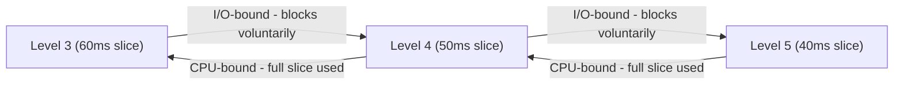

# Scheduling

Source: `system/resched.c`, `include/dynsched.h`, `system/clkdisp.S`,
`system/clkhandler.c`, `system/clkinit.c`, `system/sleep.c`,
`system/create.c`, `system/ready.c`, `system/getavgresptime.c`,
`system/cpuapp.c`, `system/ioapp.c`, `system/sneaky.c`, `include/process.h`.

## The problem

Stock XINU schedules strictly by fixed priority: `resched()` compares the
running process against the head of the ready list and switches if it
loses, and priority never changes on its own. That treats a CPU-bound
batch job and an interactive process identically, which is the wrong
trade-off: an interactive process wants to run briefly and often, a
CPU-bound one wants long uninterrupted runs. This work replaces the
*policy*, how priority and time slice evolve, while keeping XINU's
existing ready-list mechanism.

**This is a scheduling policy, not a new queue data structure.** The
course handout directs students to reuse XINU's existing priority-ordered
ready list "as if it were" a multilevel feedback queue, rather than build
an actual array of nine FIFO queues. Nothing in this repository implements
nine physical queues. `insert()`/`dequeue()` on the one ready list are
unchanged. What changed is what priority and time slice a process carries
when it goes back on that list.

## Design

Every priority level 0 through 8 has a table entry describing what happens to a
process dispatched at that level, depending on how it behaves. Each entry
(`include/dynsched.h:4-8`) holds three sixteen-bit fields: the priority to
assign next if the process turns out CPU-bound, the priority to assign next
if it turns out I/O-bound, and the time slice length for that level.

`sched_tab[9]`, defined and populated in
`system/initialize.c:23,215-221`, holds nine such entries, one per priority
level 0 through 8. A process that burns its whole slice is
demoted to a *lower* priority with a *longer* slice next time; one that
blocks voluntarily is promoted to a *higher* priority with a *shorter*
slice; one that is merely preempted by something else waking up keeps its
priority and gets back the unused remainder of the slice it lost. Slices
run inversely to priority: high-numbered (high-urgency) levels get short
slices, low-numbered (low-urgency) levels get long ones, so a demoted
CPU-bound process trades responsiveness for fewer, longer runs.

Three adjacent levels show the pattern (level 1 is the floor for CPU-bound
demotion, level 8 is the ceiling for I/O-bound promotion):

## Key data structure

`sched_tab[9]` (54 bytes total) plus six fields added to `struct procent`
in `include/process.h:60-65`: `prtotalcpu`, `prtotalresp`, `prtimeinready`,
`prctxswcount`, `prschedclass`, `prremainslice`, totaling 20 bytes per process.
`prschedclass` is the classification tag (1 = CPU-bound, 2 = I/O-bound,
3 = preempted); `prremainslice` is where a preempted process's unused
quantum is parked between dispatches.

## Mechanism

The hard part is that `resched()` cannot itself tell *why* it was called:
time-slice depletion, a voluntary block, and being preempted by another
process all end up calling it. So each candidate path tags the process
before rescheduling:

- **Time-slice depletion**: `system/clkhandler.c:48` sets class 1 when the
  per-tick preemption counter reaches zero.
- **Voluntary block**: `system/sleep.c:49` sets class 2 immediately before
  a process blocks.
- **External preemption**: the default; `system/create.c:56` seeds class
  3 for a brand-new process, and `resched.c` resets it to 3 after every
  dispatch, so anything not explicitly tagged 1 or 2 is treated as "lost
  the CPU through no fault of its own."

`resched()` reads that tag once per call and applies the table: demote and
re-slice on class 1, promote and re-slice on class 2, and for class 3
capture the live preemption counter into `prremainslice` so the next
dispatch restores it instead of handing out a fresh quantum: a process
repeatedly preempted by unrelated activity must not be repeatedly
short-changed. On dispatch, a process with a saved remainder gets that
back; otherwise it gets `sched_tab[priority].timeslice`.

A second subtlety is *when* per-process CPU time is folded into the
lifetime total: it happens immediately before `ctxsw()`, not after. For a
brand-new process, `ctxsw()` does not return into `resched()` at all. It
jumps straight into the process's entry point via the fabricated stack
frame described in the process-management writeup, so accounting done
"after the switch" silently never runs for a process's first dispatch.
Doing it before, as this code does, gets that edge case right.

Response time uses a three-case estimator in `getavgresptime()`
(`system/getavgresptime.c`): a ready process that has run before averages
its historical total against its current wait; a ready process on its
first wait reports the raw wait so far; anything else reports its running
average, with a divide-by-zero guard for a process that has never been
dispatched. The course specification's formula also requires rounding a
zero wait-time sample up to 1 ms rather than recording a true zero; that
rounding step (`system/resched.c`, immediately before the response-time
accumulation) was missing from the submitted work and was added when this
repository was assembled. See "Corrections" below.

**Merge-only addition.** `createv1()`/`createv2()` (lab 1 part 2) let a
caller keep its requested priority instead of the mid-range default that
stock `create()` now hardcodes for the scheduler's benefit. Combined with
the dispatch-table lookup, a process dispatched at a priority outside
`sched_tab`'s nine entries would index past the array. `resched.c` clamps
`prprio` to the table's upper bound both when the outgoing process
re-enters the ready state and when the incoming process is dispatched: two
lines in each spot. `prprio` is a signed `pri16` and `chprio` performs no
validation, so nothing stops it going negative in principle, but nothing in
this tree drives it there. This clamp exists purely because the merge puts a
priority-preserving create path and a nine-entry table in the same tree for
the first time; neither existed alongside the other in the original
coursework.

## Adversarial workload

`sneaky()` (`system/sneaky.c`) is a deliberate attack on the one-bit
classifier: it busy-waits on the kernel's own preemption counter until it
is nearly exhausted, then sleeps for 1 ms, consuming almost an entire
slice like a CPU-bound process but blocking just before depletion, so it is
tagged class 2 and promoted. The result is a process with CPU-bound
throughput at I/O-bound priority. It is also a layering violation by
construction: application code reads a kernel-internal counter without
disabling interrupts, which is exactly why the exploit works, and exactly
why real schedulers use decayed usage history rather than a single-bit
last-behavior test.

## Measured result

The figures below are from the student's original lab 2 tree, run and
built on its own before any lab was merged with any other; the unified
kernel in this repository has not been booted, so nothing here should be
read as having been re-observed post-merge.

- Benchmark harness: 5 scenarios (pure CPU-bound, pure I/O-bound, mixed,
  staggered creation, and the adversarial mix) driving 31 process
  creations, with 9 automated PASS/FAIL assertions covering the clock,
  accounting, response-time formula, table contents, and per-case priority
  outcomes.
- This lab required the most rebuild iterations of the six (51, versus a
  median in the 20s to 30s), consistent with it touching the scheduler's core
  dispatch path, the highest blast-radius change in this body of work.
- Linked image produced: `xinu` 154,736 bytes / `xinu.xbin` 131,584 bytes.

## Corrections made during assembly

- `include/dynsched.h`'s `struct sched_ent` was missing a semicolon after
  its last field in the submitted work: a warning on the course's
  cross-compiler, an error on stricter ones. Fixed.
- The response-time rounding rule above (diff of 0 rounds up to 1 ms) was
  specified by the course and missing from the submission. Added.

## Known limitations

- The millisecond counter is declared in `system/initialize.c` rather than
  `system/clkinit.c` as the handout specifies: functionally identical,
  literal deviation from the spec text.
- The benchmark apps test a relative elapsed time
  (`clkcounterms - start < TIMER_LIMIT`) rather than the absolute
  boot-relative check the handout describes; arguably more useful for the
  staggered-creation scenario, but a deviation.
- `sneaky()`'s interrupt-unsafe read of `preempt` is intentional (it is the
  exploit) but is a genuine layering violation, not a pattern to reuse
  elsewhere.
