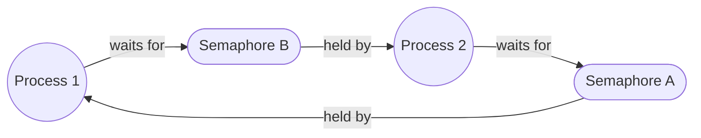

# Synchronization and Deadlock Detection

Source: `include/circular_buffer.h`, `system/circular_buffer.c`,
`include/producer_consumer.h`, `system/producer_consumer_init.c`,
`system/produce_characters.c`, `system/consume_characters.c`,
`include/deadlock_detection.h`, `system/deadlock_detection.c`,
`system/dd_wait.c`, `system/dd_signal.c`, `system/detect_deadlock.c`,
`system/semdelete.c`, `include/process.h`.

## The problem

This lab has two parts. First, the textbook bounded-buffer producer/
consumer problem: coordinate a writer and a reader across a fixed-size ring
buffer using semaphores, without a full or empty buffer causing either side
to corrupt data. Second, and the harder part: build deadlock detection for
XINU's semaphores, using only static memory (the handout explicitly forbids
`getmem()` here), under the restriction that a process can wait on at most
one semaphore and a semaphore can be held by at most one process at a time.

## Design: producer/consumer

A 30-byte ring buffer (`include/circular_buffer.h`) plus three semaphores:
a mutex protecting the buffer, and two counting semaphores tracking empty
and full slots. Both producer and consumer acquire the *resource*
semaphore (empty slots for the producer, full slots for the consumer)
**before** the mutex: that ordering is what prevents deadlock between a
producer blocked on a full buffer and a consumer blocked on an empty one;
reversing it can deadlock the pair.

## Design: deadlock detection

The general resource-allocation-graph problem needs real graph storage.
The two restrictions above, wait-on-one and held-by-one, mean every node in
that graph has out-degree exactly one, which collapses it into two flat
arrays instead of any pointer-based structure:

```c
extern pid32 sem_owner[NSEM];      /* semaphore -> holding process */
extern sid32 proc_waiting[NPROC];  /* process -> semaphore it awaits */
```

(`include/deadlock_detection.h:7-8`, with `NO_PROC`/`NO_SEM` as the `-1`
sentinels for "no edge here.") That is 50 entries of `int32` for
NSEM=30, NPROC=20: 200 bytes, no dynamic allocation, satisfying the
handout's constraint directly.

## Mechanism

**Maintaining the graph** happens inside two semaphore primitives,
`dd_wait()` and `dd_signal()` (`system/dd_wait.c`, `system/dd_signal.c`),
which are stock `wait()`/`signal()` with roughly five original lines each
spliced in to keep the two arrays synchronized with every block, wake, and
ownership change a semaphore goes through. The genuinely hard part is not
the bookkeeping itself but its timing: on a handoff, when a blocked waiter
is chosen to run, the graph has to move from "this process is waiting on
this semaphore" to "this process owns this semaphore" as a single atomic
step with respect to the periodic detector, carried out while interrupts
are still disabled. If the detector's poll fell in a gap between those two
updates, it would not see a stale-but-consistent graph. It would see a
semaphore with no recorded owner at all, as though nothing held it. A real
cycle passing through that semaphore at that instant would be
undetectable, not just delayed to the next poll. `semdelete()` needs the
same discipline for a related reason: a destroyed semaphore has to have
its ownership record cleared, or a stale edge left behind manufactures
phantom cycles for the rest of the kernel's uptime. The interesting
engineering in this pair of files is entirely in guaranteeing the detector
can never observe that in-between state: the array updates themselves are
simple once that ordering constraint is satisfied.

**Finding a cycle** is then just following the one outgoing edge at each
node: from a semaphore, jump to its holder; from that process, jump to the
semaphore it's waiting on; repeat. Arriving back at the starting semaphore
means a cycle; hitting an unheld semaphore or a holder who isn't waiting on
anything means that chain is fine. `detect_deadlock()`
(`system/detect_deadlock.c`) iterates candidate starting semaphores and
walks each chain with a `steps <= NPROC` bound so a malformed graph cannot
hang the walk, printing every semaphore/process pair along a detected
cycle. It runs from the millisecond clock handler every 500 ms
(`system/clkhandler.c:27-29`, gated on `clkcounterms % 500 == 0`), which is
why the detector is polling rather than triggered at acquisition time.

The minimal two-process, two-semaphore cycle this detects looks like this:



## Measured result

- Graph state: 200 bytes, statically allocated, for NSEM=30/NPROC=20.
- Graph update (`dd_wait`/`dd_signal`): **O(1)** per call.
- Cycle detection: **O(NSEM × NPROC)** worst case, 600 pointer-chase steps,
  run once every 500 ms.
- Circular buffer: 30 bytes of buffer plus two `uint32` indices, 38 bytes
  of live state.
- Test coverage: 1-producer/1-consumer, 2P/2C, and a buffer-full scenario
  (40 characters into a 30-slot buffer) for the bounded-buffer side; a
  2-process/2-semaphore inverted-lock-order scenario and a 3-process/
  3-semaphore circular-wait scenario for deadlock detection, verified by
  visual inspection of the printed cycle rather than automated assertions.

## Corrections made during assembly

- `include/circular_buffer.h` originally declared the buffer array
  `static` inside a header pulled into every translation unit via
  `include/xinu.h`, so every `.c` file compiled its own private, unused
  copy and `-Wall` flagged an unused variable across the whole tree. The
  handout's own specification asked for this. The array declaration and
  storage were split into an `extern` declaration in the header and a
  single definition in `system/circular_buffer.c`, clearing roughly 195
  warnings.
- `consume_characters()` wrote one byte past the caller-requested length
  (`buf[len] = '\0'`) to null-terminate a buffer the handout only
  guarantees is at least `len` bytes: a real one-byte overflow for a
  caller passing an exactly-sized buffer. Removed.
- `check_deadlock()`, an earlier, unused design where the acquisition path
  itself checked for a cycle rather than the clock handler polling for
  one, was declared and defined but never called anywhere in the tree:
  13 lines of dead code. Dropped.

## Known limitations

- The single-owner model is exact for binary semaphores but produces a
  wrong graph for a counting semaphore initialized above 1: a second
  acquirer simply overwrites `sem_owner`, losing the first. The handout
  restricts the problem to single-owner semaphores, so this is in scope,
  but this is not general-purpose deadlock detection for arbitrary
  counting semaphores.
- `detect_deadlock()` calls `kprintf()` from inside the clock interrupt
  handler. `kprintf()` is synchronous, polled UART output. On a detected cycle this prints
  one line per cycle member from interrupt context, which can add
  non-trivial latency to a 1 ms tick. The handout asks for exactly this
  placement, so it is not a grading issue, but it is a real cost to be
  able to explain.
- Deadlock detection is verified by inspecting printed output for the two
  constructed scenarios, not by an automated assertion.
