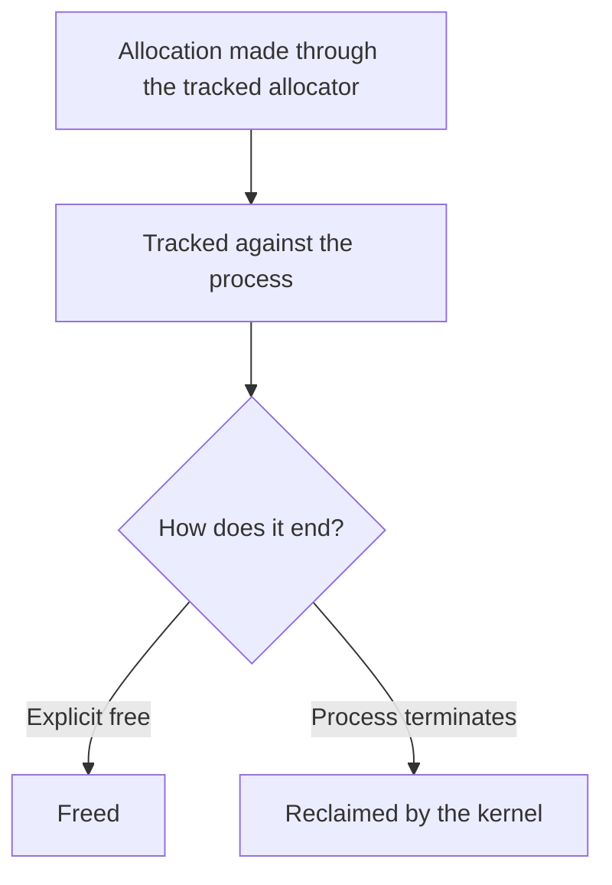

# Garbage Collection

Source: `system/gc_getmem.c`, `system/gc_freemem.c`, `system/kill.c`,
`include/garbage_collection.h`, `include/process.h`, `system/createv1.c`,
`system/createv2.c`.

## The problem

XINU frees a terminating process's *stack* in `kill()` (via `freestk()`),
but never its heap. Anything a process obtained from `getmem()` and never
handed back stays allocated for the life of the boot. This cannot be fixed
in user code, because the whole failure mode is a process that dies
*without* running its own cleanup: killed externally, or crashed. The fix
has to live in the kernel, at the one place every process's death passes
through.

## Design

Rather than a static table of allocations (the specification explicitly
disallows one), each process gets its own linked list of every block it
currently owns. Two wrapper calls, `gc_getmem()`/`gc_freemem()`, mirror
`getmem()`/`freemem()` but additionally splice a tracking node into that
list; `kill()` walks whatever is left in a process's list and returns it
to the heap.

## Key data structure

Each tracking node (`include/garbage_collection.h`) carries three fields:
the address of the block it tracks, that block's size, and a pointer to the
next node in the process's list, 12 bytes total. Each process-table entry
gets one new field, `struct gc_memblk *headptr` (`include/process.h:66`),
the head of that process's list, kept sorted by ascending block address.

## Mechanism

`gc_getmem()` (`system/gc_getmem.c`) delegates the actual allocation to
`getmem()` unchanged, then allocates a 12-byte tracking node, also via
`getmem()`, since a static table is off the table, and inserts it into the
calling process's list in address order. The detail most implementations
of this pattern skip: if the *node* allocation fails after the *data*
allocation already succeeded, the data block is returned to the heap
before reporting failure, so a failed tracking call cannot itself become a
leak.

`gc_freemem()` (`system/gc_freemem.c`) walks only the calling process's own
list, looking for a node whose address and size both match exactly, and
returns `SYSERR` if none is found. Because it never looks at any other
process's list, cross-process protection falls out of the search scope
rather than from any address-range check. There is no overlap test
anywhere in the code, and none is needed: a block another process owns
simply is not on the caller's list, so it cannot be found and freed. That
framing matters: this is ownership-by-construction, not an implemented
overlap detector.

`kill()`'s reclamation hook (`system/kill.c`) walks `prptr->headptr`
unconditionally, freeing both the tracked data block and its node for each
remaining entry, before the state-specific cleanup switch runs, so it
fires on every exit path, not only a clean voluntary exit.

Put simply, every tracked allocation has exactly two possible endings:

## Measured result

The figures below are from the original garbage-collection tree, built and
run on its own before anything was merged with anything else. The unified
kernel in this repository has since been booted on hardware, but that is a
separate run and nothing below was re-observed on it.

- `struct gc_memblk`: 12 bytes per outstanding allocation; `headptr`: 4
  bytes per process-table entry.
- `gc_getmem` insertion, `gc_freemem` lookup, and `kill()` reclamation are
  each **O(n)** in the calling process's outstanding-allocation count.
- Test harness, three scenarios: a normal allocate-and-free; a
  leak-then-terminate case verified by summing XINU's own free-block chain
  before and after the leaking process exits, confirming the leaked bytes
  came back; and a cross-process free attempt. The free-list byte-sum
  audit is a real verification technique, not just a printed assertion.
- Linked image produced: `xinu` 146,224 bytes / `xinu.xbin` 123,392 bytes.

## Merge-only addition

`createv1()` and `createv2()` (lab 1 part 2) predate this collector and
never initialized a field that did not exist when they were written. Once
merged together, both now set `prptr->headptr = NULL` alongside their
other process-table setup, because `kill()` walks `headptr`
unconditionally on every process, including ones created through either
path: an uninitialized pointer there would not be a missed feature, it
would be memory corruption during teardown the first time such a process
exits.

## Known limitations (preserved, not fixed)

**`gc_freemem` unlinks before it frees: a real leak on either of two
failure paths.** The tracking node is removed from the process's list
before either of the two `freemem()` calls that follow is attempted: one
releases the caller's data block, the other releases the 12-byte tracking
node itself. If the first `freemem()` call (the data block) returns
`SYSERR`, the function returns immediately with the node already dropped
from tracking, so the block is neither freed at that point nor reclaimed
later by `kill()`: both the data block and the node are gone from
bookkeeping. If the data block frees successfully but the second
`freemem()` call (the node) returns `SYSERR`, the data block is correctly
released but the node itself is now unreachable, already unlinked from
the process's list, and leaks instead. This is left in place deliberately, as a real defect in the
original version, rather than silently corrected. The fix is straightforward
in principle: unlink only after both frees succeed. But making that
change here would mean rewriting the original behavior after the fact, so
it stands as documented, disclosed technical debt.

Two smaller, intentional deviations from "works exactly like
`getmem`/`freemem`":

- `gc_freemem` requires an **exact** `(address, size)` match. Stock
  `freemem()` permits freeing a sub-range of a larger allocation; this
  wrapper rejects any size mismatch outright. Conservative rather than
  dangerous, but a real behavioral difference.
- The harness's own cross-process test passes a size that does not match
  the original allocation, so it returns `SYSERR` for two reasons at once
  (wrong owner and wrong size) and does not cleanly isolate the property
  it claims to demonstrate.
