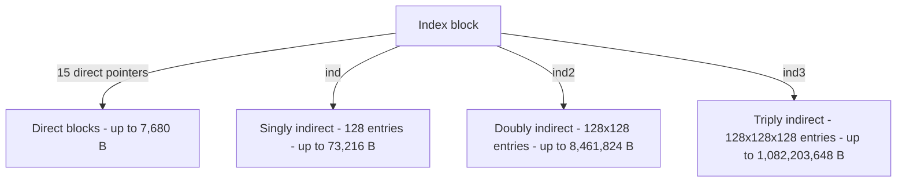

# Filesystem: Indirect Block Resolution

Source: `device/lifs/lifsetup.c`; supporting code I did not write:
`include/lifilesys.h`, `device/lifs/lifindballoc.c`,
`device/lifs/lifdballoc.c`, `device/lifs/lifflush.c`.

## Attribution: read this first

**Twenty-one of the twenty-two files in `device/lifs/`, plus
`include/lifilesys.h`, are pre-existing starter code I did not write**, unmodified.
That starter code defines the on-disk and in-memory control-block layouts,
the index-block and data-block allocators, and the flush logic. **The
single file here that is mine is `device/lifs/lifsetup.c`.** Its starter
version worked only for file offsets within the first 15 direct blocks and
halted with a kernel panic on any offset past that: a halt, not a returned
error. My contribution replaces
that panic with a working three-level indirect block walk. Nothing here
should be read as "wrote a file system": the
accurate claim is "extended the block-resolution path of an existing
filesystem driver to add three levels of indirection."

## The problem

A filesystem has to answer one question for every read or write: given a
byte offset into a file, which physical disk block holds it? The starter
answers that only for the first 7,680 bytes of a file, via 15 direct
pointers stored in the file's index block. Anything past that returns an
error. The goal is to extend that answer using the classic Unix
inode scheme: pointers-to-pointers, so a fixed-size index block can address
far more data than it has room to point at directly.

## Key data structure

The existing index block already reserves the pointers this
design needs: an array of 15 direct block pointers, plus one scalar pointer
each for the singly, doubly, and triply indirect levels, all four fields
sharing the same block-id type.

Each indirect pointer, when followed, leads to a 512-byte block holding
128 more 4-byte pointers (`LIF_NUM_ENT_PER_BLK = LIF_BLKSIZ / sizeof
(dbid32)`). One level of indirection therefore multiplies addressable
space by 128. The in-memory file-control-block side (also
pre-existing) mirrors this with one cache buffer per level, a data
block plus one buffer each for the singly, doubly, and triply indirect
blocks, and one dirty flag per buffer, five in total.

The overall shape fans out from the index block, one branch per level of
indirection:

## The mechanism

`lifsetup()` (`device/lifs/lifsetup.c`, function body lines 6-217) is
called with the file's current byte position and has to produce the disk
block that covers it. The function's structure is a four-way dispatch on
which region the position falls into:

| Region | Byte range | Pointer path |
|---|---|---|
| Direct | 0 to 7,679 | `lifiblock.ib_dba[position / 512]` |
| Singly indirect | 7,680 to 73,215 | `ind` → one 128-entry block |
| Doubly indirect | 73,216 to 8,461,823 | `ind2` → 128-entry block → 128-entry block |
| Triply indirect | 8,461,824 to 1,082,203,647 | `ind3` → three levels of 128-entry blocks |

Within each indirect region, the byte offset is decomposed into one array
index per level by successive division and modulo by the region size one
level down, the same arithmetic a multi-digit positional number system
uses to pull out each digit. At each level, if the pointer is currently
null the block is allocated fresh; if it points at a block already in the
level's in-memory cache, no disk access is needed; otherwise the block is
read from disk into that level's cache. Every one of the three indirect
regions repeats this same allocate-or-load step once per level of
indirection it needs to traverse.

**The design choice worth noting** is that all four regions, once they've
resolved to "here is where the data-block pointer lives," converge on one
shared piece of code rather than duplicating the leaf-allocation logic four
times: a local pointer variable tracks *where* the resolved data-block
pointer lives (inside the direct array, or inside whichever indirect
buffer was just resolved), and a flag records whether that location is
inside an indirect block or the inode itself, which determines which of
the five dirty flags gets set if a new data block has to be allocated.
That shared tail also handles allocating the data block itself if none
exists yet.

**The other design choice worth noting** is when the five dirty buffers
get flushed: before anything else happens, based on whether *any* of the
five flags is set, not just the two the starter code originally tracked.
Skipping any one of the three indirect buffers in that check would let a
newly-allocated but unflushed indirect block get silently dropped the next
time the position moves to a different region.

## Measured result

| Region | Capacity added | Cumulative max file size |
|---|---|---|
| 15 direct blocks | 7,680 B | 7,680 B (starter's limit) |
| + singly indirect | 65,536 B | 73,216 B |
| + doubly indirect | 8,388,608 B | 8,461,824 B |
| + triply indirect | 1,073,741,824 B | 1,082,203,648 B (~1.008 GiB) |

Maximum file size increases roughly **140,900×** over the direct-only
starter. Block resolution is **O(1)**, at most three disk reads
regardless of offset, where the original linked-index-block design used
elsewhere in XINU (`device/lfs/`) is **O(offset / index-block span)**: for
a byte near the 1 MB mark, that design would walk on the order of 100
index blocks in sequence; this one reads at most two.

**Build status.** This file's final edit has been cross-compiled
successfully as part of assembling this repository: it is not merely
present in the tree, the kernel containing it links into a loadable image.
That says nothing about runtime behavior; see the next section.

## Known limitations

- **No bound on the third-level index.** The arithmetic that decomposes a
  byte offset into per-level array indices for the triply-indirect path
  does not check that the resulting third-level index stays within the
  128-entry block it indexes into. A file position beyond the theoretical
  1.008 GiB maximum would compute an out-of-range index and write past the
  end of that in-memory block, into adjacent fields of the file control
  structure. In practice the file's seek path bounds position by the
  file's current size, and the ramdisk this was exercised against is far
  smaller than the theoretical maximum, so this is unreachable in
  my own testing, but the guard is genuinely absent, and this is
  disclosed rather than silently patched.
- **The doubly- and triply-indirect paths were never exercised at
  runtime.** My own test harness writes 10,000 bytes and seeks
  to offset 20,000, both well inside the singly-indirect region, which
  extends to byte 73,216. The test ramdisk (`RM_BLKS` in
  `include/ramdisk.h`) is 16,777,216 bytes, comfortably large enough to
  reach the doubly-indirect region: disk size is not why those paths went
  untested. The reason is the harness itself: nothing in it ever seeks or
  writes past 73,216. The bonus-tier code (doubly and triply indirect) is
  implemented and its arithmetic checks out on inspection, but it has no
  test evidence behind it. State it as "implemented, exercised only for the
  singly-indirect path," not "implemented and validated."
- **One of the harness's own tests is a false positive.** A "deep seek"
  test opens a brand-new, empty file and immediately seeks to offset
  20,000. The underlying seek call rejects any offset past the file's
  current size, which is zero for a fresh file, so the seek fails
  silently, the subsequent write lands at offset 0 instead of 20,000, and
  the read that follows correctly retrieves what was just written at
  offset 0. The test prints success. It is testing that a write-then-read
  round-trips at offset 0, not that seeking works: the offset-20,000
  claim in the test's own name and output is not what happened. This is
  the single most important limitation to disclose about this lab, because
  it is exactly the kind of thing a careful reviewer would otherwise
  discover independently.
